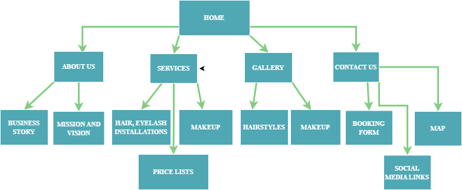

# Project Title
Amo's MakeOver

## Student Information
**Student number:** ST10505448  
**Student Name:** Samantha Tinotenda Chovava

## Project Overview

Amo’s Makeover is a small local beauty business that offers professional hair styling and makeup services. It was founded by Amogelang Vena, a 22-year-old entrepreneur from Limpopo, staying in Cosmo City, Gauteng. After completing her matric at 19, Amo experienced unemployment and struggled to find opportunities. She decided to take a 3-month professional course in hairdressing and makeup artistry, which transformed her passion into a career. She is now a skilled stylist who provides beauty services for various clients and special occasions.

This business’s mission is to help individuals feel confident, elegant, and beautiful through high-quality makeover services in a welcoming, professional environment, ensuring satisfaction with every visit.

Its vision is to grow Amo’s Makeover into a well-recognised beauty brand for weddings, fashion event and special occasions in both urban and rural areas.

## Website Goals and Objectives

The website aims to promote Amo’s Makeover Salon by showcasing hair styling and makeup services, displaying a portfolio of client transformations, and providing easy communication channels for bookings and enquiries. Customers will be able to request appointments, ask for custom makeup looks, and view service packages.

Success will be measured according to following KPIs: 
Number of website visitors, which will tell how many people are finding and viewing the website. A high number means marketing is going well, people are interested.
Booking requests submitted, which shows how many visitors are acting into the booking services. A high number of bookings means the website is convincing and effective.
Social media engagement (likes, shares, comments), which will measure how people interact with the content online. High engagement means the business is reaching more potential clients.
Repeat client bookings, this shows customer satisfaction and loyalty. If clients come back, it means they were happy with the services.

## Timeline and Milestones

MARCH 2026
23-27 March 2026
I read through the assignment brief and marking rubric so I could understand what the website needed. I also looked up different websites for ideas on layouts, menus and colours.
28-3 March 2026
I started working closely and gathering information from the salon owner I was referred to since she granted me permission to create a website for her business. I asked about the services she offers, what her goals were and what info needed to go on the site.

APRIL 2026
5 April 2026
I kept working on my proposal research and I also made my GitHub account so I could save my work and keep track of changes.
7-8 April 2026
I brainstormed ideas for the website and planned how it would be set up. I decided on the menu links, what to call each page and the basic layout.
9 April 2026
I started coding the HTML pages and finished setting up my GitHub repo. I uploaded the first files and tested if the navigation between pages was working.
10 April 2026
I added headings, pictures and info abou the salon to the pages. I kept fixing the content and trying to make the layout look better.
11 April 2026
I finished my wireframes and sitemap. I also went back to edit my proposal docs while improving how the website would work.
12 April 2026
I submitted the proposal documents and double-checked the Part 1 requirements before I continued building the site.
20 April 2026
I submitted the entire Part 1 including all the HTML files and the Github repository link.

MAY 2026
Early May 2026
I got feedback from my lecturer for Part 1. He pointed out that I needed better HTML comments, a changelog and clearer commit messages on Github.
28 May 2026
I started fixing the website based on the feedback. I added proper comments to the HTML, updated the page titles and corrected small HTML errors I found while testing. I also created an external style.css file and linked it to all 5 HTML pages so I could start the Part 2 styling.
29 May 2026- Part 2 Submission Day
I kept fixing errors and making sure all the pages looked the same. I finished adding comments to the HTML and kept working on the CSS to improve how the site looked. I took screenshots of the site on different screen sizes, checked all the HTML files one last time, reviewed my GitHub repo and then submitted Part 2.

## Sitemap

 

## References

Cloudflare. 2026. Web Hosting Pricing.[Online]. Available at: https://www.cloudflare.com/learning/dns/glossary/what-is-a-domain-name/. [Accessed: 10 April 2026]
Figma. 2026. Figma [Collaborative Interface Design Tool]. Available at: https://www.figma.com [Accessed: 11 April 2026].
GitPages.2026.Git Pages Documentation.[Online]. Available at: https://pages.github.com/. [Accessed: 19 June 1026]
GoDaddy. 2026. Domain and hosting. [Online]. Available at: https://www.godaddy.com/en-ph/hosting/web-hosting. [Accessed: 10 April 2026].
Venu, A. 2026. Hair stylist & makeup artist. [Telephonic conversation]. 7 April 2026.
W3schools. 2026. HTML. [Online] Available at: https://www.w3schools.com/html/ [Accessed: 17 April 2026]
